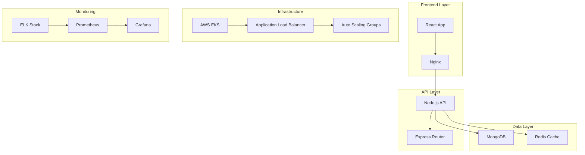

# 🚀 URL Shortener - Enterprise DevOps Project

[](https://github.com/AnujGupta1606/12210849/actions)
[](https://github.com/AnujGupta1606/12210849/actions)
[](https://codecov.io/gh/AnujGupta1606/12210849)
[](LICENSE)
[](https://hub.docker.com/r/anujgupta1606/url-shortener)
[](k8s/)

> A production-ready URL Shortener built with modern DevOps practices, featuring comprehensive CI/CD, monitoring, security, and cloud-native architecture.

## 📋 Table of Contents

- [🎯 Project Overview](#-project-overview)
- [🏗️ Architecture](#-architecture)
- [🚀 Features](#-features)
- [🛠️ Technology Stack](#-technology-stack)
- [📦 Quick Start](#-quick-start)
- [🐳 Docker Deployment](#-docker-deployment)
- [☸️ Kubernetes Deployment](#-kubernetes-deployment)
- [🔧 CI/CD Pipeline](#-cicd-pipeline)
- [📊 Monitoring & Observability](#-monitoring--observability)
- [🔒 Security](#-security)
- [📈 Performance](#-performance)
- [🧪 Testing](#-testing)
- [📚 Documentation](#-documentation)
- [🤝 Contributing](#-contributing)

## 🎯 Project Overview

This URL Shortener project demonstrates enterprise-level DevOps practices and cloud-native architecture. It showcases:

- **Microservices Architecture** with React frontend and Node.js backend
- **Complete CI/CD Pipeline** with automated testing, security scanning, and deployment
- **Container Orchestration** with Docker and Kubernetes
- **Infrastructure as Code** using Terraform
- **Comprehensive Monitoring** with Prometheus, Grafana, and ELK stack
- **Security Best Practices** with SAST, DAST, and container scanning
- **High Availability** with auto-scaling and load balancing

## 🏗️ Architecture



## 🚀 Features

### Application Features
- ✅ URL shortening with custom aliases
- ✅ Click tracking and analytics
- ✅ QR code generation
- ✅ Bulk URL processing
- ✅ User dashboard
- ✅ Real-time statistics
- ✅ URL expiration management
- ✅ Custom domain support

### DevOps Features
- 🔄 **CI/CD Pipeline**: Automated build, test, and deployment
- 🐳 **Containerization**: Docker multi-stage builds
- ☸️ **Orchestration**: Kubernetes with Helm charts
- 🏗️ **Infrastructure as Code**: Terraform for AWS
- 📊 **Monitoring**: Prometheus, Grafana, ELK stack
- 🔒 **Security**: SAST, DAST, container scanning
- 🚀 **Auto-scaling**: HPA and cluster autoscaling
- 🔐 **Secrets Management**: Kubernetes secrets and AWS Secrets Manager
- 📈 **Performance Testing**: K6 load testing
- 🧪 **End-to-End Testing**: Playwright automation

## 🛠️ Technology Stack

### Frontend
- **React 19** with TypeScript
- **Material-UI** for components
- **React Router** for navigation
- **PWA** capabilities

### Backend
- **Node.js** with Express
- **MongoDB** for persistence
- **Redis** for caching
- **Winston** for logging
- **Prometheus** client for metrics

### DevOps & Infrastructure
- **Docker** & **Docker Compose**
- **Kubernetes** & **Helm**
- **AWS EKS** & **Terraform**
- **Jenkins** & **GitHub Actions**
- **Prometheus** & **Grafana**
- **ELK Stack** for logging
- **OWASP ZAP** for security testing

### Security & Monitoring
- **Snyk** & **SonarQube** for code analysis
- **Trivy** for container scanning
- **Falco** for runtime security
- **Istio** service mesh (optional)

## 📦 Quick Start

### Prerequisites
- Node.js 18+
- Docker & Docker Compose
- kubectl (for Kubernetes)
- Terraform (for infrastructure)

### Local Development

1. **Clone the repository**
   ```bash
   git clone https://github.com/AnujGupta1606/12210849.git
   cd 12210849
   ```

2. **Install dependencies**
   ```bash
   # Frontend
   npm install
   
   # Backend
   cd backend && npm install
   ```

3. **Environment setup**
   ```bash
   cp .env.example .env
   # Edit .env with your configurations
   ```

4. **Start development servers**
   ```bash
   # Frontend (port 3000)
   npm start
   
   # Backend (port 5000)
   cd backend && npm run dev
   ```

5. **Access the application**
   - Frontend: http://localhost:3000
   - Backend API: http://localhost:5000
   - API Documentation: http://localhost:5000/docs

## 🐳 Docker Deployment

### Quick Start with Docker Compose

```bash
# Build and start all services
docker-compose up -d

# View logs
docker-compose logs -f

# Stop services
docker-compose down
```

### Available Services
- **Frontend**: http://localhost:3000
- **Backend API**: http://localhost:5000
- **MongoDB**: localhost:27017
- **Redis**: localhost:6379
- **Prometheus**: http://localhost:9090
- **Grafana**: http://localhost:3001 (admin/admin123)
- **Kibana**: http://localhost:5601

### Health Checks
```bash
# Check all services
docker-compose ps

# Backend health
curl http://localhost:5000/health

# Prometheus targets
curl http://localhost:9090/api/v1/targets
```

## ☸️ Kubernetes Deployment

### Prerequisites
- Kubernetes cluster (minikube, EKS, GKE, AKS)
- kubectl configured
- Helm 3.x

### Deploy with Kubectl

```bash
# Create namespace and deploy
kubectl apply -f k8s/namespace.yaml
kubectl apply -f k8s/

# Check deployment status
kubectl get pods -n url-shortener
kubectl get services -n url-shortener
kubectl get ingress -n url-shortener
```

### Deploy with Helm

```bash
# Add dependencies
helm dependency build helm/url-shortener

# Install the chart
helm install url-shortener helm/url-shortener -n url-shortener --create-namespace

# Upgrade deployment
helm upgrade url-shortener helm/url-shortener -n url-shortener

# Check status
helm status url-shortener -n url-shortener
```

### Monitoring Deployment

```bash
# Watch pod status
kubectl get pods -n url-shortener -w

# Check logs
kubectl logs -f deployment/backend-deployment -n url-shortener

# Port forward for local access
kubectl port-forward svc/frontend-service 8080:80 -n url-shortener
```

## 🔧 CI/CD Pipeline

### GitHub Actions Workflow

The project includes a comprehensive CI/CD pipeline with:

1. **Code Quality**: ESLint, TypeScript checks
2. **Security Scanning**: SAST with CodeQL, dependency scanning with Snyk
3. **Testing**: Unit tests, integration tests, E2E tests
4. **Container Security**: Image vulnerability scanning with Trivy
5. **Deployment**: Automated deployment to staging and production
6. **Monitoring**: Post-deployment health checks and smoke tests

### Jenkins Pipeline

```bash
# Build the project
./jenkins/build.sh

# Run tests
./jenkins/test.sh

# Security scan
./jenkins/security-scan.sh

# Deploy to staging
./jenkins/deploy-staging.sh

# Deploy to production (manual approval required)
./jenkins/deploy-production.sh
```

### Pipeline Stages

1. **Checkout & Setup**
2. **Code Quality & Security**
3. **Build & Test**
4. **Container Build & Scan**
5. **Deploy to Staging**
6. **Integration Testing**
7. **Security Testing (DAST)**
8. **Performance Testing**
9. **Deploy to Production**
10. **Post-deployment Validation**

## 📊 Monitoring & Observability

### Metrics Collection
- **Application Metrics**: Custom metrics with Prometheus client
- **Infrastructure Metrics**: Node Exporter for system metrics
- **Database Metrics**: MongoDB and Redis exporters
- **Business Metrics**: URL creation rate, click-through rate

### Dashboards
- **Application Dashboard**: Request rate, response time, error rate
- **Infrastructure Dashboard**: CPU, memory, disk, network
- **Business Dashboard**: URL statistics, user analytics
- **Security Dashboard**: Security events, vulnerability status

### Alerting
```yaml
# Example alert rules
groups:
  - name: url-shortener
    rules:
      - alert: HighErrorRate
        expr: rate(http_requests_total{status_code=~"5.."}[5m]) > 0.1
        for: 5m
        labels:
          severity: critical
        annotations:
          summary: High error rate detected
```

### Log Aggregation
- **Structured Logging**: JSON format with correlation IDs
- **Centralized Collection**: ELK stack for log aggregation
- **Log Retention**: 30-day retention with archival to S3
- **Search & Analytics**: Kibana dashboards for log analysis

## 🔒 Security

### Security Measures

1. **Code Security**
   - SAST with SonarQube and CodeQL
   - Dependency vulnerability scanning
   - Secret scanning in CI/CD

2. **Container Security**
   - Non-root containers
   - Minimal base images
   - Regular image updates
   - Runtime vulnerability scanning

3. **Infrastructure Security**
   - Network segmentation with VPC
   - IAM least privilege access
   - Encryption at rest and in transit
   - Security group restrictions

4. **Application Security**
   - Input validation and sanitization
   - Rate limiting and DDoS protection
   - CORS and security headers
   - JWT token security

### Security Testing

```bash
# SAST
npm run security:scan

# Dependency check
npm audit

# Container scanning
docker run --rm -v /var/run/docker.sock:/var/run/docker.sock \
  aquasec/trivy image url-shortener:latest

# DAST
docker run -t owasp/zap2docker-stable zap-baseline.py \
  -t http://localhost:3000
```

## 📈 Performance

### Performance Targets
- **Response Time**: 95th percentile < 500ms
- **Throughput**: 1000 requests/second
- **Availability**: 99.9% uptime
- **Error Rate**: < 0.1%

### Load Testing

```bash
# Install k6
curl https://github.com/grafana/k6/releases/download/v0.46.0/k6-v0.46.0-linux-amd64.tar.gz \
  -L | tar xvz --strip-components 1

# Run load test
k6 run tests/load-test.js
```

### Performance Optimization
- **Caching**: Redis for frequent data
- **CDN**: CloudFront for static assets
- **Database**: Optimized queries and indexing
- **Auto-scaling**: HPA based on CPU and memory

## 🧪 Testing

### Test Types

1. **Unit Tests**
   ```bash
   # Frontend
   npm test

   # Backend
   cd backend && npm test
   ```

2. **Integration Tests**
   ```bash
   npm run test:integration
   ```

3. **End-to-End Tests**
   ```bash
   npx playwright test
   ```

4. **API Tests**
   ```bash
   newman run tests/api-tests.postman_collection.json
   ```

5. **Performance Tests**
   ```bash
   k6 run tests/load-test.js
   ```

### Test Coverage
- **Target**: 80% code coverage
- **Reports**: Generated in CI/CD pipeline
- **Quality Gate**: Failing tests block deployment

## 📚 Documentation

### API Documentation
- **OpenAPI/Swagger**: Interactive API documentation
- **Postman Collection**: Ready-to-use API examples
- **SDK Examples**: Code examples in multiple languages

### Operational Documentation
- **Runbooks**: Step-by-step operational procedures
- **Troubleshooting**: Common issues and solutions
- **Architecture Decision Records**: Design decisions and rationale

### Development Documentation
- **Setup Guide**: Local development environment
- **Coding Standards**: Code style and best practices
- **Contribution Guide**: How to contribute to the project

## 🤝 Contributing

We welcome contributions! Please see our [Contributing Guide](CONTRIBUTING.md) for details.

### Development Workflow
1. Fork the repository
2. Create a feature branch
3. Make your changes
4. Add tests for new functionality
5. Ensure all tests pass
6. Submit a pull request

### Code Style
- Follow ESLint rules
- Use Prettier for formatting
- Write meaningful commit messages
- Add JSDoc comments for functions

## 📄 License

This project is licensed under the MIT License - see the [LICENSE](LICENSE) file for details.

## 🙏 Acknowledgments

- [OWASP](https://owasp.org/) for security guidelines
- [Cloud Native Computing Foundation](https://cncf.io/) for Kubernetes
- [Prometheus](https://prometheus.io/) monitoring system
- [Grafana](https://grafana.com/) for visualization

## 📞 Support

- **Documentation**: [docs.your-domain.com](https://docs.your-domain.com)
- **Issues**: [GitHub Issues](https://github.com/AnujGupta1606/12210849/issues)
- **Discussions**: [GitHub Discussions](https://github.com/AnujGupta1606/12210849/discussions)
- **Email**: support@your-domain.com

---

**Built with ❤️ using modern DevOps practices**


